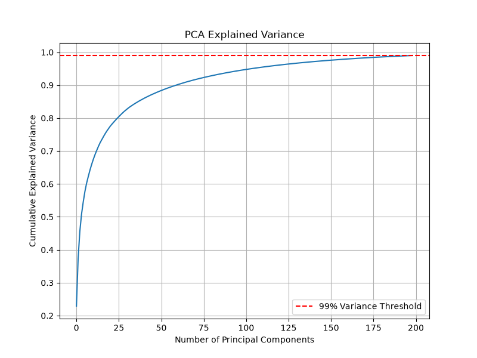
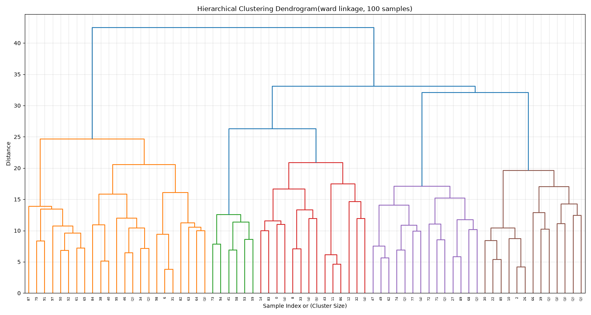
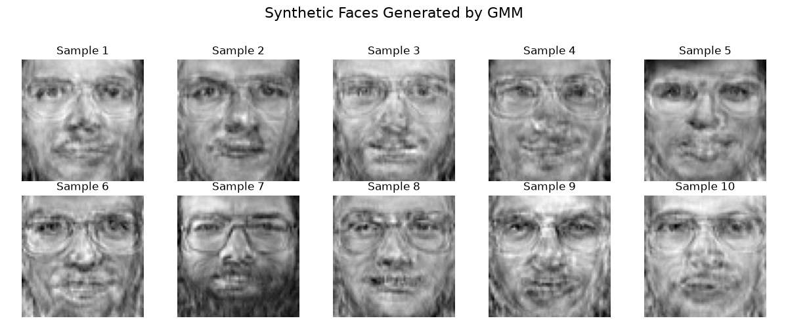
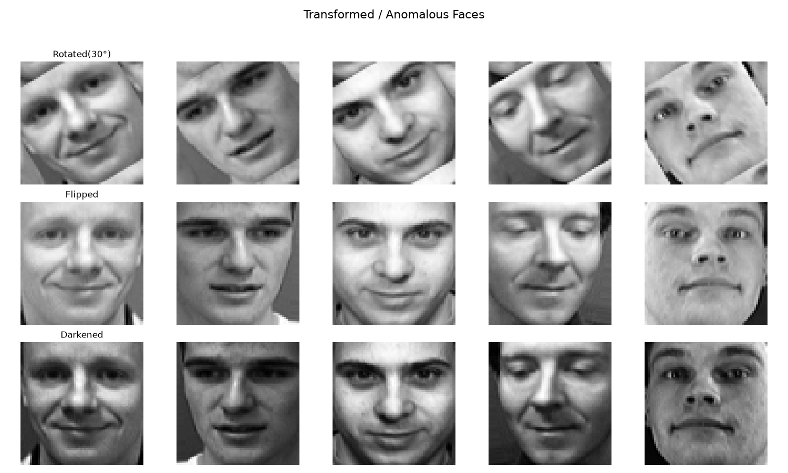
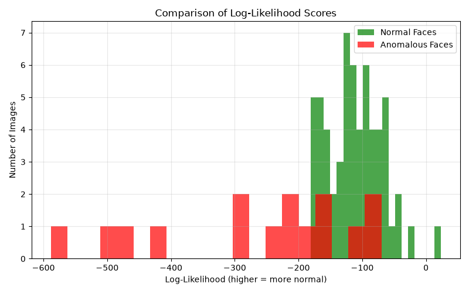

# Clustering & Anomaly Detection on Olivetti Faces

## Overview

This project explores unsupervised learning techniques for clustering and anomaly detection using the Olivetti Faces dataset.

The pipeline applies Principal Component Analysis (PCA) for dimensionality reduction, hierarchical clustering for exploring facial similarity, and Gaussian Mixture Models (GMM) for probabilistic clustering and anomaly detection.

GMM configurations are compared using AIC and BIC on a validation set. The selected model is then used for hard and soft cluster assignments, synthetic face generation, and anomaly detection based on sample log-likelihood.

## Tech Stack

- Python
- Scikit-learn
- NumPy
- Pandas
- Matplotlib
- Seaborn
- SciPy
- Scikit-image
- ImageIO

## Pipeline

1. Load and visualize the Olivetti Faces dataset.
2. Split the dataset into training, validation, and test sets using stratified sampling.
3. Flatten the 64×64 facial images and apply PCA while retaining 99% of the explained variance.
4. Apply Ward hierarchical clustering and visualize the resulting hierarchy with a dendrogram.
5. Train Gaussian Mixture Models across multiple covariance types and component counts.
6. Compare GMM configurations using AIC and BIC on the validation set.
7. Refit the selected GMM using the combined training and validation data.
8. Generate hard and soft cluster assignments for the test set.
9. Generate synthetic facial images by sampling from the fitted GMM and applying PCA inverse transformation.
10. Create artificial anomalies using rotation, horizontal flipping, and gamma-based darkening.
11. Compare normal and anomalous samples using GMM log-likelihood scores.

## Results

PCA reduced each facial image from 4,096 pixel features to 199 principal components while retaining 99% of the explained variance.

The GMM model-selection process selected:

- Covariance type: `spherical`
- Number of components: `20`
- Validation BIC: `30,797.35`

For anomaly detection, the fitted GMM produced the following average log-likelihood scores:

- Normal test images: `-111.05`
- Artificially anomalous images: `-262.31`

The substantially lower log-likelihood of the transformed images indicates that the GMM assigns lower probability density to samples that differ from the learned distribution of normal facial images.

## Project Structure

```text
.
├── src/
│   ├── data.py
│   ├── pca.py
│   ├── clustering.py
│   ├── gmm.py
│   ├── anomaly.py
│   └── main.py
├── outputs/
│   ├── figures/
│   └── results/
├── requirements.txt
└── README.md
```
## Visual Results

### PCA Explained Variance

PCA reduced the original 4,096-dimensional facial images to 199 principal components while retaining 99% of the explained variance.



### Hierarchical Clustering

A dendrogram was generated from a subset of 100 training samples using Ward linkage to visualize the hierarchical relationships between facial images.



### Synthetic Faces Generated by GMM

The selected Gaussian Mixture Model was sampled in PCA feature space. The generated samples were then transformed back into the original 64×64 image space using PCA inverse transformation.



### Anomaly Detection

Artificial anomalies were created using rotation, horizontal flipping, and gamma-based darkening.



The GMM assigned substantially lower average log-likelihood to the anomalous samples:

- Normal test images: `-111.05`
- Anomalous images: `-262.31`



## Usage

Clone the repository and install the required dependencies:

```bash
pip install -r requirements.txt
```

Run the complete machine learning pipeline from the project root:

```bash
python src/main.py
```

The pipeline will automatically:

1. Load and split the Olivetti Faces dataset.
2. Apply PCA dimensionality reduction.
3. Perform hierarchical clustering.
4. Select and fit a Gaussian Mixture Model.
5. Generate hard and soft cluster assignments.
6. Generate synthetic facial images.
7. Create transformed anomalous samples.
8. Compare normal and anomalous samples using GMM log-likelihood.

Generated CSV results and images are stored under the `outputs/` directory.